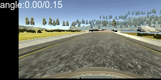
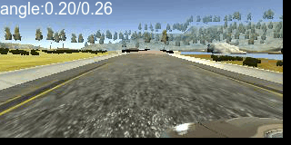
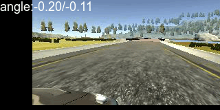

#Learn human driving behavior based on deep neural network

##### Table of Contents  
1. [Overview](#Overview)
2. [Existing Solutions](#Existing_Solutions)
⋅⋅* [Nvidia](#nvidia)
⋅⋅* [Commaai](#commaai)

<a name="Overview"/>
#Overview
This is [UDacity](https://www.udacity.com/drive) Self Driving Car Behavioral Cloning Project

Lots of blog / repositories in internet just show you their final result, but how did they reach their beautiful 
final result is really the most important part for a learner point of view.

This repository arms to help me as a newbie and helps you who is learning deep learning to
1. Easy to experiment, from simply apply CNN model to very complex data augment
2, Reproducible, every bad result we keep it reproducible so that we know we made a mistake buy what reason
3. Visualise what's going on
4. Build more understanding about how deep learning works

To help achieve above goal, all code base has been formed by below layers or pipes

| Layer             | Purpose                                                                                           |
| ------------------|---------------------------------------------------------------------------------------------------|
| DriveDataSet      | Represent the data you recorded                                                                   |
| --filter_method   | What data you'd like to added in                                                                  |
| RecordAllocator   | Before pass recorded data to data augment, percentage of different data you'd like to added in    |
| generators        | Data augment process you'd like to apply to, easy to extend to any order                          |
| DataGenerator     | Read from RecordAllocator, pass to generator, then feed data into Keras generator                 |
| model             | the Network                                                                                      |
| Trainer           | create Model, read data from DataGenerator, do the real training                                  |


When we put everything together, the simple form of code looks like:
```python
def raw_data_centre_image_only():
    # Create DriveDataSet from csv file, you can specify crop image, using all cameras and which data will included in
    data_set = DriveDataSet.from_csv(
        "datasets/udacity-sample-track-1/driving_log.csv", crop_images=False, all_cameras_images=False,
        filter_method=drive_record_filter_include_all)
    # What the data distribution will be, below example just randomly return data from data set, so that the
    # distribution will be same with what original data set have
    allocator = RecordRandomAllocator(data_set)
    # what's the data augment pipe line have, this have no pipe line, just the image itself
    augment = image_itself
    # connect allocator and augment together
    data_generator = DataGenerator(allocator.allocate, augment)
    # create the model
    model = nvidia(input_shape=data_set.output_shape(), dropout=0.5)
    # put everthing together, start a real Keras training process with fit_generator
    Trainer(model, learning_rate=0.0001, epoch=10, custom_name=raw_data_centre_image_only.__name__).fit_generator(
        data_generator.generate(batch_size=128)
    )
raw_data_centre_image_only()
```

the code to make our car running in both track 1 and 2
```python
def segment_std_distribution_shift_flip_brightness_shadow():
    data_set = DriveDataSet.from_csv(
        "datasets/udacity-sample-track-1/driving_log.csv", crop_images=True, all_cameras_images=True,
        filter_method=drive_record_filter_include_all)
    # fine tune every part of training data so that make it meat std distrubtion
    allocator = AngleSegmentRecordAllocator(
        data_set,
        AngleSegment((-1.5, -0.5), 10),  # big sharp left
        AngleSegment((-0.5, -0.25), 14),  # sharp left
        AngleSegment((-0.25, -0.249), 3),  # sharp turn left (zero right camera)
        AngleSegment((-0.249, -0.1), 10),  # big turn left
        AngleSegment((-0.1, 0), 11),  # straight left
        AngleSegment((0, 0.001), 4),  # straight zero center camera
        AngleSegment((0.001, 0.1), 11),  # straight right
        AngleSegment((0.1, 0.25), 10),  # big turn right
        AngleSegment((0.25, 0.251), 3),  # sharp turn right (zero left camera)
        AngleSegment((0.251, 0.5), 14),  # sharp right
        AngleSegment((0.5, 1.5), 10)  # big sharp right
    )
    # a pipe line with shift -> flip -> brightness -> shadow augment processes
    augment = pipe_line_generators(
        shift_image_generator(angle_offset_pre_pixel=0.002),
        flip_generator,
        brightness_image_generator(0.35),
        shadow_generator
    )
    data_generator = DataGenerator(allocator.allocate, augment)
    model = nvidia(input_shape=data_set.output_shape(), dropout=0.5)
    Trainer(model, learning_rate=0.0001, epoch=45, multi_process=use_multi_process,
            custom_name="bigger_angle_shift_0.002_bright_0.35_angles_35_30_35").fit_generator(
        data_generator.generate(batch_size=256)
    )
```

<a name="Existing_Solutions"/>
#Existing Solutions
<a name="nvidia"/>
###NVIDIA
Nvidia has published a nice paper [End to End Learning for Self-Driving Cars](https://images.nvidia.com/content/tegra/automotive/images/2016/solutions/pdf/end-to-end-dl-using-px.pdf).
This video will makes you very exciting.

<a href="http://www.youtube.com/watch?feature=player_embedded&v=-96BEoXJMs0
" target="_blank"></a>

<a name="commaai"/>
###Commaai
[The Paper](https://arxiv.org/abs/1608.01230)
[Github Repository](https://github.com/commaai/research)
[train_steering_model.py](https://github.com/commaai/research/blob/master/train_steering_model.py)

<a name="data_collection"/>
#Data Collection
1. [UDacity](https://d17h27t6h515a5.cloudfront.net/topher/2016/December/584f6edd_data/data.zip) 
provided a simulator and produced a sample data for track 1 that you can use.
**this is recommended way**
2. Generate your data from UDacity Self-Driving Car Simulator
3. [Sully Chen](https://github.com/SullyChen) 
had a [TensorFlow implementation](https://github.com/SullyChen/Autopilot-TensorFlow) 
and shared his own [dataset](https://drive.google.com/file/d/0B-KJCaaF7ellQUkzdkpsQkloenM/view?usp=sharing)

UDacity Sample data

<a href="http://www.youtube.com/watch?feature=player_embedded&v=LLCXS-uCMSw" target="_blank">
</a>


#Iterations
##Iteration 1 Centre Image Only, no dropout
```python
def raw_data_centre_image_only():
    # Create DriveDataSet from csv file, you can specify crop image, using all cameras and which data will included in
    data_set = DriveDataSet.from_csv(
        "datasets/udacity-sample-track-1/driving_log.csv", crop_images=False, all_cameras_images=False,
        filter_method=drive_record_filter_include_all)
    # What the data distribution will be, below example just randomly return data from data set, so that the
    # distribution will be same with what original data set have
    allocator = RecordRandomAllocator(data_set)
    # what's the data augment pipe line have, this have no pipe line, just the image itself
    augment = image_itself
    # connect allocator and augment together
    data_generator = DataGenerator(allocator.allocate, augment)
    # create the model
    model = nvidia(input_shape=data_set.output_shape(), dropout=0.0)
    # put everthing together, start a real Keras training process with fit_generator
    Trainer(model, learning_rate=0.0001, epoch=10, custom_name=raw_data_centre_image_only.__name__).fit_generator(
        data_generator.generate(batch_size=128)
    )
```
**50seconds** per epoch, final loss **0.004**, total trainable params: **32,213,367**, the weights file has 128mb

car gose wild and running into water before bridge


##Iteration 2 Centre Image Only with 0.5 dropout
dropout created much better result, with everything remands same, it able to drive
much more smooth and able to pass bridge, from now on we will always has 0.5 dropout
```python
def raw_data_centre_image_dropout_5():
    data_set = DriveDataSet.from_csv(
        "datasets/udacity-sample-track-1/driving_log.csv", crop_images=False, all_cameras_images=False,
        filter_method=drive_record_filter_include_all)
    allocator = RecordRandomAllocator(data_set)
    augment = image_itself
    data_generator = DataGenerator(allocator.allocate, augment)
    # dropout=0.5 was the only difference
    model = nvidia(input_shape=data_set.output_shape(), dropout=0.5)
    Trainer(model, learning_rate=0.0001, epoch=10, custom_name=raw_data_centre_image_dropout_5.__name__).fit_generator(
        data_generator.generate(batch_size=128)
    )
```
**50seconds** per epoch, final loss **0.012**, total trainable params: **32,213,367**, the weights file has 128mb


##Iteration 3 Center/Left/Right Images
It fails on road which don't have a clear edge. what if we add left and right camera 
images in? as they are more point towards to road edge, we are expecting model will
gain better knowledge about road edge.

Compare to iteration 2, our car at least trying to make a little turn before run out.
```python
def raw_data_centre_left_right_image():
    # all_cameras_images=True was the only difference
    data_set = DriveDataSet.from_csv(
        "datasets/udacity-sample-track-1/driving_log.csv", crop_images=False, all_cameras_images=True,
        filter_method=drive_record_filter_include_all)
    allocator = RecordRandomAllocator(data_set)
    generator = image_itself
    data_generator = DataGenerator(allocator.allocate, generator)
    model = nvidia(input_shape=data_set.output_shape(), dropout=0.5)
    Trainer(model, learning_rate=0.0001, epoch=10, custom_name=raw_data_centre_left_right_image.__name__).fit_generator(
        data_generator.generate(batch_size=128)
    )
```
**50seconds** per epoch, final loss **0.024**, total trainable params: **32,213,367**, the weights file has 128mb


##Iteration 4 Center/Left/Right with Crop
By remove the informat we know won't effecting steering angle, for example sky, we 
can make our model more focuse to the things that matters.
by reduce image size from 160x320 to 66x200, we reduced the training time from 50 seconds 
epoch to 10 seconds! the trainable parames reduced from **32,213,367** to **1,595,511**
and the result is amazing, we are able to pass until next right turn

The cropped version of sample data video:
<a href="http://www.youtube.com/watch?feature=player_embedded&v=pxG46j9kK0I" target="_blank">
</a>

```python
def raw_data_centre_left_right_image_crop():
    # crop_images=True was the only difference
    data_set = DriveDataSet.from_csv(
        "datasets/udacity-sample-track-1/driving_log.csv", crop_images=True, all_cameras_images=True,
        filter_method=drive_record_filter_include_all)
    allocator = RecordRandomAllocator(data_set)
    generator = image_itself
    data_generator = DataGenerator(allocator.allocate, generator)
    model = nvidia(input_shape=data_set.output_shape(), dropout=0.5)
    Trainer(model, learning_rate=0.0001, epoch=10, custom_name=raw_data_centre_left_right_image_crop.__name__).fit_generator(
        data_generator.generate(batch_size=128)
    )
```
**10seconds** per epoch, final loss **0.033**, total trainable params: **1,595,511**, the weights file has 6.4mb


##Iteration 5 Shift Image Randomly
so far we have made use of all provided data, and our car able to drive half of the lap,
it seems that we need some how create more data so that our car knows how to make a good
right turn.
Other idea is that shift the images and adjust angles accordingly.
for example, center image with angle 0, move 10 pixels left would result angle 0.02





As we introduced random generator here, every batch our model will see different image so that we can't cache,
the crop we did and enable multi_process is a life saver (espicially we will do more augment later),

If we allow images shift 100 pixels, the number of samples could grow from 24,100 images to 2,410,000
that's great for your model

```python
def raw_data_centre_left_right_crop_shift():
    data_set = DriveDataSet.from_csv(
        "datasets/udacity-sample-track-1/driving_log.csv", crop_images=True, all_cameras_images=True,
        filter_method=drive_record_filter_include_all)
    allocator = RecordRandomAllocator(data_set)
    # shift_image_generator added in
    generator = shift_image_generator(angle_offset_pre_pixel=0.002)
    data_generator = DataGenerator(allocator.allocate, generator)
    model = nvidia(input_shape=data_set.output_shape(), dropout=0.5)
    # have to enable multi_process as image generator becomes to bottle neck
    Trainer(model, learning_rate=0.0001, epoch=20, multi_process=use_multi_process,
            custom_name=raw_data_centre_left_right_crop_shift.__name__).fit_generator(
        data_generator.generate(batch_size=128)
    )
```
**160seconds** per epoch, final loss **0.036**, total trainable params: **1,595,511**, the weights file has 6.4mb


###Iteration 5, remove shift from left and right camera images
while look at the video, I noticed that it's go wild when approch road side, that's must be something wrong 
with shift image, the angle we offset may too much, the left/right image we are using may use different ratio.
so that in this test, just simple remove left right image before shift.
As you can see in video, the car is much more smooth and can drive longer.
```python
data_generator = DataGenerator(
    random_generators(
        center_image_generator,
        pipe_line_generators(
            random_center_left_right_image_generator,
            shift_image_generator
        )
    ))
```


###Iteration 6 Flip Image
```python
data_generator = DataGenerator(
    random_generators(
        random_center_left_right_image_generator,
        pipe_line_generators(
            center_image_generator,
            shift_image_generator
        ),
        pipe_line_generators(
            random_center_left_right_image_generator,
            flip_generator
        )
    ))
```

###Iteration 7 The dropout to rescue
0.5 Droput in every lay improved the performance much better


###Iteration 8 Convert generator to batch model and convert into Tensorflow 
after add flip image, it took 2 minutes for every epoch, which is still too long for me.
most of the time, my GPU is waiting for image to been generated. 
convert the augment into tensorflow to do it in batch, gpu and true multiple thread


###Iteration 9 Feeding data distribution
It looks we running out of option for augment our data, one way is go back to simulator and generate more data,
also we know the model should work, the issue must be in the data, either not enough or we baies the model too much,
in track 1, car is turning left far more than right, maybe that's why our car not able to handle the turning right 
very well.
let's look back and see what kind of data we feed into model.
The Udacity Sample data has below distribution
<image>
As you can see, angle 0 (going straight) has far more samples, as we used left and right camera data, 0.25 and -0.25
is same.
what it happened in real world of our steering angle distributed? I guess maybe it's 25% of left and right turn, 50% 
of straight.